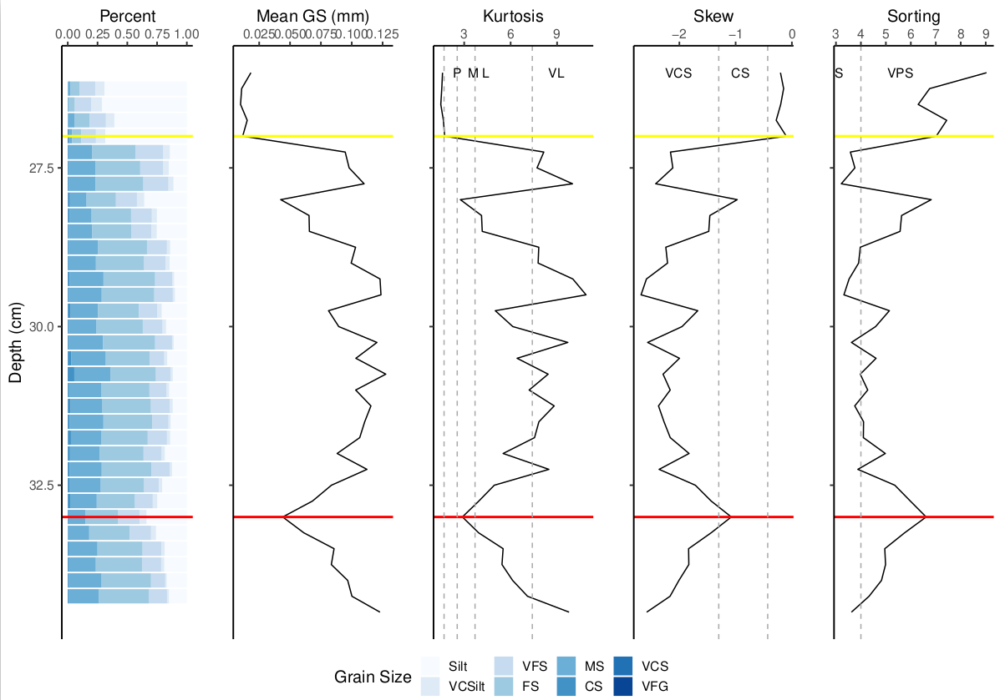

# SEPwC Sediment Analysis Coursework

## Introduction

Your task is to write code to read in an Excel file continaing sediment 
grain analysis. The script should calcualte grain statistics (such as kurtosis, 
sorting, etc) and plot a figure which displayed the grainsizes, mean grain size, 
kurtosis, sorting and skew, as a funciton of depth throgh the core. 



The script should take an optional argument to read in a "depth file" which 
contains the depth of the bottom and top of the deposit of itnerest in the core
(here a tsunami deposit). These depths should be plotted on the output too.

Your script should output a single graphic only. It should A4 landscape in size.


## The tests

The test suite uses a test data set and one of the files from the main data set.

You can run the tests by running `Rscript test_script.R` in the `test` directory, 
or from R directly:

```R
library(testthat)
test_file("test_script.R")
```

from the test directory. Try it now, before you make any changes!

## The data

The data provided are three Excel files with percentage of each grain size
(in microns) at each depth of the core. The depths are every 2.5 mm from an arbitrary base.
The columns are the grain sizes, the rows are the depths. 

There is also a CSV file with data for the top and bottom of the deposit of interest
for each file, which looks like this:

|  File       | Top     | Bottom
|-------------|---------|--------
| core_13.xlsx|	22.75   |  30
| core_16.xlsx|	27      |  33
| core_17.xlsx|	27.75   |  43

The first column is the filename, the other two columns are hopefully obvious!

You should be able to run a script and produce something like the above graphic with

```bash
Rscript sediment_analysis.R  data/core_16.xlsx -d data/depth_data.csv test.pdf
```

The program should not print anything unless the user has used the verbose flag. 

Sediment statistics can be generated using the `G2sd` package. You can find more information
here <https://cran.r-project.org/web/packages/G2Sd/G2Sd.pdf>. Part of the exercise is on how to 
usefully use the output of this package to get what you need.


## Hints and tips

Read the `G2sd` documentation and play around this with to figure out how to get data out of it.

The `tidyverse` functions to read in data are very helpful here. Likewise, the `ggplot2` info
on the SEPwC website (and the internet in general) will be very helpful in plotting thigs. 

## The rules

You cannot alter any of the `expect_*()` calls in `test/test_script.R`

If you alter any function names in the main code, you *can* alter the name
in the test file to match; however the rest of the test must remain unchanged. 
This will be checked.

If you wish to add more tests, please do, but place them in a separate file
in the `test` directory. Remember to name the file `test_something.R`.

You can also add extra functionality, but the command-line interface must pass
the tests set.
